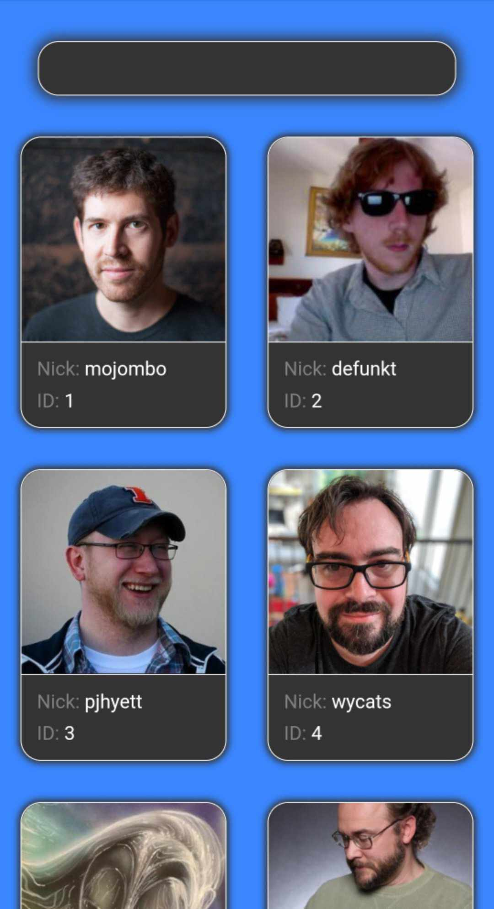

# GitHub-Users
GitHub Users created by Patryk 'UltiPro' Wójtowicz using JavaScript, AJAX and Fetch.

The application allows you to load GitHub users starting with ID equal to 1, as well as searching for a specific user by its nickname. Users are displayed on cards with a nickname and ID. After clicking on the user's card, we are taken to its GitHub profile in a new tab.

# Usage

Link to application: [click](https://ultipro.github.io/GitHub-Users/)

# Preview

    
    
    

